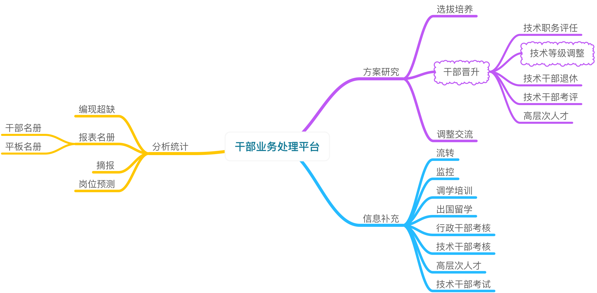

# MHR 总体需求分析

## 1 研究背景
目前，我公司人力资源工作依托上级配发的CHR完成各类人才信息管理。CHR的主要功能是数据存储，在业务处理上无法及时、准确满足我公司的人员资源管理需要。出于既要继续使用指定系统的要求，又要满足我公司个性化功能的现实需要，计划基于CHR设计研发衍生产品MHR。

> CHR是一套基于oracle数据库底层、CS结构的MIS系统。

## 2 研究目标
项目旨在设计开发一套BS结构人力资源信息管理系统，在CHR基础上增加[方案研究](proposal_requirement.md)、[分析统计](statistics_requirement.md)、[信息补充](supplementaryinfo_requirement.md)三项业务。

## 3 技术选型
- 程序语言: Python
- 网站框架: Django
- 数据库: mysql & oracle。项目需要两个数据库，一是选择Mysql/Oracle作为主体业务数据库，二是选择性应用CHR的oracle数据库。
- 前端工具: Bootstrap / JQuery / Html5 / CSS /Datetable
- 后端工具: Bracker / PyCharm / Vim 
- 项目管理: Bitbucket / Github 

## 4 项目分工和进度
- 2017.03 初步需求分析和前端小样
- 2017.04 需求分析和前端界面定稿
- 2017.05 数据库建模定型
- 2017.06 完成方案研究模块、信息补充模块
- 2017.07 测试和培训
- 2017.10 完成分析研究模块

## 界面演示
* [MHR主页](http://123.207.161.77)
