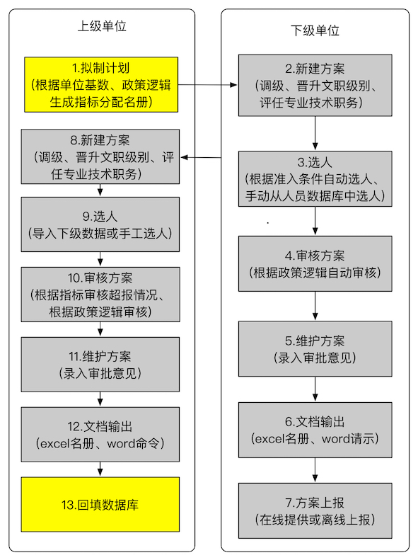

# 方案研究模块
方案研究是MHR项目三个主体模块之一，其他两个模块分别是分析统计、信息补充。

## 业务背景
人力资源管理工作中，办理人员职务晋升、调整交流、考核评价等工作时，管理部门通常需要进行方案研究，一般包括组织提名、机关审核、方案处理、文件下达等工作。这些工作具有相同的业务流程、相似的业务规则。为避免重复劳动、提供审核效率，有必要通过信息化手段完成方案研究工作。这项工作有三个特点：

1. 种类较多。从业务分类看，包括科技干部调整专业技术等级、专业技术资格评定、专业技术干部考评、人才奖评选、出国留学、培训送学、退休、调动等。每一类方案中还包括具体的细类，比如调整专业技术等级方案中包括正常调级、提前调级，还包括高职调级、中职调级等不同分类方式。
2. 流程相同。任何一类业务，都可以归纳选人、审核、方案处理、报表生成、回填数据库等五个固定的流程。
3. 规则迥异。尽管有相同的流程，但每个流程中，都有着不同的业务规则，这些规则包括准入条件、审核逻辑、报表模板、方案研究要素展示、数据回填办法。

以上已知的方案种类和业务规则，都有可能因为今后的政策调整而发生改变，也有可能为了满足不同机构个性化需求而发生调整。因此，**方案处理模块需要提供灵活健壮的规则定制能力。这一理念，还将贯穿MHR的全部设计之中。**

## 预期功能
基于以上业务背景，方案处理模块功能可以三个部分。

1. 方案流程：

  * 第1步 新建方案: 提供方案代号、名称、业务大类、创建人、创建时间、是否共享、共享对象（允许何人查看或共享编辑）等信息。
  * 第2步 添加候选对象：原则上必须从CHR（上级指定使用的Oracle的MIS系统）的数据库中导入候选对象，特定情况下也可以手工录入。提供三种添加方式：（1）根据单位树形结构查看人员第二种是根据准入条件；（2）根据准入条件查询结果选定，运行查询前可限定单位范围和统计截止时间；（3）导入已有方案，导入方案适用于没有网络条件单位上报数据时使用，导入时应与已添加对象进行比对，相同时需要提醒是否覆盖。
  * 第3步 审核校验：添加对象后，需要进行两个阶段的审核工作：（1）当数据是由下级逐级上报得来的，就需要对方案内容中的所有字段与本地数据库（本地的CHR数据库内容）进行比对，发现不一致的需要进行提示，确保一致后，进行（2）根据有关政策要点建立的审核逻辑进行逐条审核，输出审核日志和具体问题条目（姓名，错误原因等），并可根据这些具体问题条目链接查询到候选人的详细情况（错误处用颜色标记）。此外，通常情况下，审核结果有两个原因，一是数据填写错误，二是候选对象不符合条件。如果出现数据填写错误，应当提供修改窗口，修改完成后可随时重复审核。审核过程应以日志形式保存。
  * 第4步 方案处理：审核结束后，经由机关填写各个阶段的研究意见（同意、不同意或者其他）。方案编辑面板以表格形式展现，可以完成排序、筛选、编辑、分类、修改显示列等功能，其中，分类指的是按单位分类、按方案细类分类、按审核结果分类。
  * 第5步 报表生成：生成相应的公文(word/pdf)和表格(excel)。
  * 第6步 导出方案：可按全部人员、自定义选定人员、审核结果等方式进行导出。导出的数据可以第2步中进行导入。
  * 第7步 数据回填：将研究结果按照不同业务规则回填CHR数据库，比如，某人技术等级由三级调整为二级，当研究结果为同意时，把CHR的技术等级、技术等级时间以及任职经历进行自动修改。

2. 后台设置
  * 方案分类：提供方案大类和方案细类两项设置，细类隶属于大类。建立方案大类时，应提供代号、名称、业务种类等字段，以下的准入条件、审核逻辑、列表设置、报表模板均要根据不同的**方案大类**分别设置。方案细类提供代号、名称、从属大类即可。
  * 准入条件：每一方案大类都要相应准入条件，比如，调级指的现技术等级时间满足相应年限达。根据方案大类可以增加编辑条件。
  * 审核逻辑：同准入条件。审核逻辑与准入条件的区别在于，准入条件用于添加候选对象之前，审核逻辑用于之后；审核逻辑的规则包括准入条件的内容，但更加丰富。
  * 列表设置：为每一方案大类的方案处理表格显示相应列内容。
  * 报表模板：为每一方案大类设计公文和表格模板样式。
  * 用户权限：方案处理模块包括三类用户，第一类用户是超级管理员，允许处理一切事务；第二类，可以维护准入条件、审核逻辑、列表设置，不可以维护方案分类、报表模板、用户权限分配；第三类是下级机关业务人员，只能新建方案和处理方案。
  * CHR数据连接设置：CHR数据库是独立于MHR的系统，因此，为了完成选人、回填数据库两项功能，必须建立于CHR的oracle数据库连接。由于每个机构的数据库都是局域网中的某台服务器，甚至每个机构的一台服务器中包括多个oracle实例，因此，通过CHR连接设置可以实现数据源的切换。**设置界面提供IP地址、TNSname两种方式进行连接。**

3. 方案展示：根据分类显示已用方案。
4. 网站基本功能：
  * 用户注册：独立的用户注册，但要将现有的一套基于Plone系统的用户合并进来。注册一般由管理员手工分配，不允许自行注册。
  * 全局检索：根据指定范围和用户权限可见性实现全文搜索，并提供二次筛选。

开发时，只针对一个大类业务处理，即专业技术干部调整专业技术等级。涉及的逻辑规则全部通过后台设置的方式设计，这是该模块的主要特点，可以适应由政策调整带来的规则变化。

## 3 URL映射
* /proposal/index.html 提供新建方案、维护方案入口，并分类展示最近方案。同时提供导航菜单、用户登陆、全局搜索功能。
* /proposal/createproposal 新建方案。
* /proposal/multipleproposal 处理方案的核心
* /proposal/listproposal 分类展示已有方案。
* /dashboard/proposal/ 完成所有后台设置。

## 4 Demo
[方案研究模块](http://123.207.161.77/proposal/index.html)
