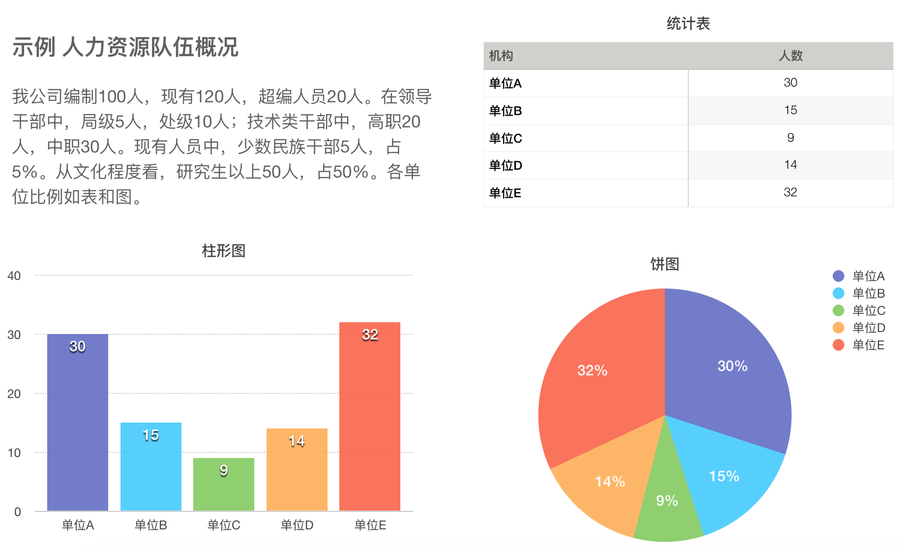
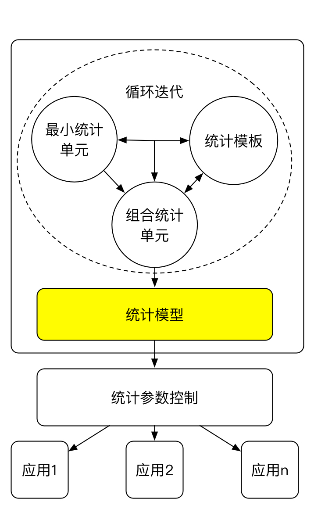

# 分析统计模块
分析统计是MHR项目中最具应用价值、开发难度最大、创新意义最强的模块。其他两个模块分别是[方案研究](proposal_requirement.md)、[信息补充](supplementaryinfo_requirement.md)。
## 1 业务背景
人力资源信息中心的核心服务业务就是应业务需求发布分析统计报告。

### 分类
这些分析统计报告可以分为两类，一是固定的、已知的常规统计，二是变化的、不确定的临时统计。对于第一类形式固定的常规分析，通常需要调整统计范围、统计时间得出不同的报告内容，主要应用场景包括人力资源队伍概况（队伍结构、文化程度、任职经历）、专业技术等级/职务晋升指标测算、领导干部队伍职级编配及任职预测。而对于第二类经常变化的临时分析，则需要进行强大的后台定制功能来快速高效生成报告内容。第二类分析经过长期业务应用后，逐步调优就会演变为第一类分析。

### 过程
常规分析统计一般包括三个过程：一是选定范围和确定时间；二是审核基本信息的准确性，比如，在统计性别时，如果某人的性别没有填写，就会造成统计结果错误；三是分析统计并检查逻辑一致性，比如，统计结果显示我们公司共有100人，男性50人，如果女性是49人的话，也会造成统计结果错误；四是生成统计报表（公文、图表）。

## 2 预期功能
从功能上讲，形式固定的分析归属前台分析统计应用，而完成临时统计则应归属后台分析统计建模应用。

### 前台分析统计应用

* ** 第1步 发起统计任务 ** 选择一个固定形式的分析统计项目后，新建统计任务。
* ** 第2步 选定统计范围 ** 在分析统计工作页面，选定统计范围、统计截止时间。统计范围选定时，既可以默认的常用条件，也可以在后台自行定义。
* ** 第3步 分析前预处理 ** 根据默认校错条件检查是否存在影响统计结果的错误记录，并提供修改界面。
* ** 第4步 统计输出结果 ** 运行统计并生成结果，结果可进行二次筛选和保存，保存时需要录入统计名称、时间、创建人等信息。
* ** 第5步 结果二次校验 ** 对逻辑一致性进行检查，对不一致的数字予以标记，并提示不一致的原因。

### 后台分析统计建模思路
设计后台建模是为了最大化提高分析统计的定制能力，通过建模把现实业务工作中随机的、没有规律的、频繁的统计工作，逐步转化为固定的、有规律可循的、规范的常规统计。后台建模的用户不是一般业务用户，而是具有一定程序员经验的系统管理员。用户可以通过共享统计模型，形成业务同行交流的社区。

#### 统计模型的元概念
* **统计单元(unit)** 一个数值型或字符串型的统计结果，分为最小统计单元和组合统计单元。最小统计单元是一个数值，比如我公司干部人数=100人；组合统计单元既可是以多个最小单元组成，也可以是由字符串+数值而组成的可读的统计结果文本，比如我公司干部人数=100人，其中，男干部人数=60人，女干部人数=40人。
* **统计模板(template) **由字符串包装统计单元并形成有意义的统计结果。比如，示例“我公司编制100人，现有120人，超编人员20人。在领导干部中，局级5人，处级10人；技术类干部中，高职20人，中职30人。“，文本+数值形成一个可供重复使用的模板。
* **统计参数(parameter)** 为了提高统计建模复用型，需要提供一些统计参数限定统计范围。比如，以上示例中，如果需要把范围缩小到子部门A，只需要在统计模型中传递一个部门为A的参数即可。

### 基本思路图

统计模型由统计单元和统计模板循环迭代而成，通过参数控制得到广泛应用。统计模板包装最小统计单元，形成组合统计单元，统计单元进一步丰富统计模板，迭代形成更有意义的统计单元，进一步形成统计模型。统计模型一旦成熟，就可以发布到前台分析统计应用。这种迭代，既发生成后台建模业务中，还将对前台的实际业务应用产生影响。

## 3 URL映射
* /statistics/index.html 提供新建统计、维护方案入口，并分类展示最近统计。
* /statistics/calculate 统计处理。
* /statistics/saveresult 结果保存
* /statistics/listproposal 分类展示已有统计。
* /statistics/proposal/ 完成所有后台设置。

## 4 Demo
[分析统计模块](http://123.207.161.77/statistics/index.html)
